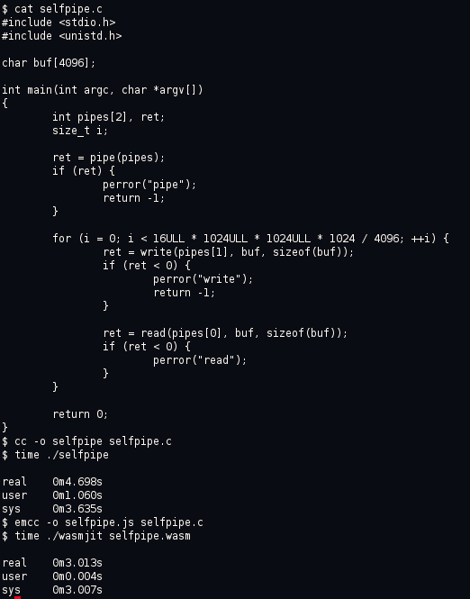

# Wasmjit

Wasmjit is a small embeddable WebAssembly runtime. Its core is written in
C90 and is easily portable to most environments.

Its primary target is a Linux kernel module that can host
Emscripten-generated WebAssembly modules. In this configuration it
runs WebAssembly modules in kernel-space (ring 0) and provides access
to system calls as normal function calls. This configuration avoids
user-kernel transition overhead, as well as scheduling overheads from
swapping page tables.  This results in a significant performance
increase for syscall-bound programs like web servers or FUSE file
systems. The performance increase is more pronounced in a
post-Spectre/Meltdown world due to PTI overhead. Check it out:

It also includes a host environment for running in user-space on POSIX
systems. This is useful for running WebAssembly modules without having
to run an entire browser.

Wasmjit is licensed under a permissive MIT license.

# Getting Started

Wasmjit currently runs on x86_64 POSIX systems, like Linux, macOS, and
the BSDs. It can also optionally use a Linux kernel module that can
significantly speed up execution. To get started with Wasmjit you need
a few tools:

* A standard POSIX C development environment that includes `cc` and
  `make`.
* [Emscripten SDK](https://kripken.github.io/emscripten-site/docs/getting_started/downloads.html)
* (Optional) Your Linux distro's kernel headers. On Debian, install
the `linux-headers-amd64` package, on Fedora, install `kernel-devel`.

## (Optional) Installing the Kernel Module

    $ make modclean
    $ make kwasmjit.ko
    $ sudo insmod ./kwasmjit.ko
    $ sudo chmod 777 /dev/wasm # See caveat below

## Building the Executable

    $ make clean
    $ make -j wasmjit

## Building and running the Example

    $ source path_to_emsdk/emsdk_env.sh # bring emcc into $PATH
    $ emcc -o selfpipe.js src/wasmjit_examples/selfpipe.c

You can now run the example:

    $ time ./wasmjit selfpipe.wasm

If you installed the Linux kernel module, this should run much quicker than
a native binary:

    $ cc -o selfpipe src/wasmjit_examples/selfpipe.c
    $ time ./selfpipe

# Status

Wasmjit can run a subset of Emscripten-generated WebAssembly
on Linux, macOS, and within the Linux kernel as a kernel module. It
currently only supports x86_64. Here are the current developments goals
in order of priority:

* Implement enough Emscripten host-bindings to run
  [`nginx.wasm`](https://www.dropbox.com/sh/lmz3nnz92jx9szh/AAA-YOEHxwM_nki8jX0uFRuqa?dl=0)
* Implement an interpreter
* Implement Rust-runtime for Rust-generated wasm files
* Implement Go-runtime for Go-generated wasm files
* Optimize x86_64 JIT
* Implement arm64 JIT
* Implement macOS kernel module

PRs are welcome :)

# Linux Kernel Mode Caveats

The code and data section allocations are done using `vmalloc()`. This
prevents those pages from ever being swapped to disk. Thus,
indiscriminately allowing access to the `/dev/wasm` device may make a
system vulnerable to denial-of-service attacks. In the future a
system-wide limit on the amount of memory used by the `/dev/wasm`
device will be provided to mitigate that risk.

# Contact

Rian Hunter [@cejetvole](https://twitter.com/cejetvole)
